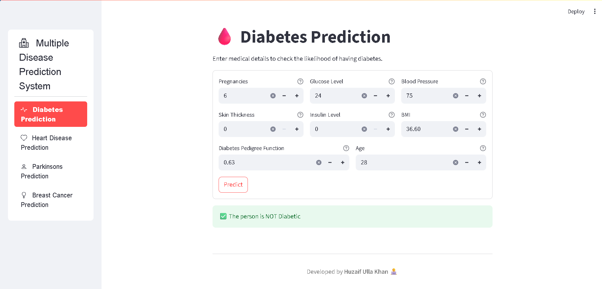
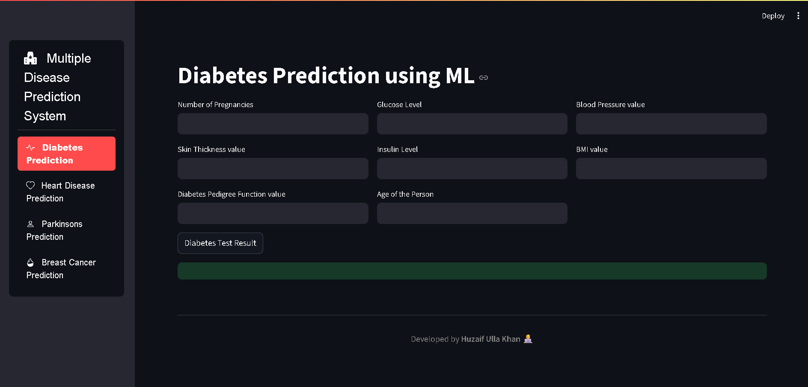

<h1 align="center">
  
  <br>
  Multiple Disease Prediction System
</h1>

<p align="center">
  <b>AI-powered health assistant to predict multiple diseases instantly</b>  
  <br>
  <a href="https://your-live-demo-link.com" target="_blank"><strong>🚀 Live Demo</strong></a> • 
  <a href="#installation">📦 Installation</a> •
  <a href="#usage">💻 Usage</a> •
  <a href="#screenshots">🖼 Screenshots</a>
</p>

---

<p align="center">
  
  
  
  
  
</p>

---

## 📖 Overview
The **Multiple Disease Prediction System** is a web-based AI application that predicts the likelihood of various diseases based on user inputs.  
Built with **Streamlit** and **Machine Learning models**, this system provides quick health insights for early detection.

**Supported Diseases:**
- 🩸 **Diabetes**
- ❤️ **Heart Disease**
- 🧠 **Parkinson’s Disease**
- 🎗 **Breast Cancer**

---

## 🛠 Tech Stack
- **Frontend:** Streamlit  
- **Backend:** Python (Scikit-learn, Pandas, NumPy)  
- **ML Models:** Logistic Regression, Random Forest, SVM  
- **Deployment:** Streamlit Cloud / Hugging Face Spaces  

---

## 🚀 Live Demo
[🔗 Click here to try the app](https://your-live-demo-link.com)  

---

## 📂 Installation

```bash
# Clone the repository
git clone https://github.com/HuzaifKhan44/Multiple-Disease-Prediction-System.git

# Navigate to project folder
cd Multiple-Disease-Prediction-System

# Install dependencies
pip install -r requirements.txt

# Run the app
streamlit run app.py
💻 Usage
Choose the disease from the sidebar.

Fill in the required health details.

Click Predict to get the result.

🖼 Screenshots
Home Page
<p align="center"> <a href="https://github.com/HuzaifKhan44/Multiple-Disease-Prediction-System/blob/main/screenshots/Image1.png">  </a> </p>
Prediction Example
<p align="center"> <a href="https://github.com/HuzaifKhan44/Multiple-Disease-Prediction-System/blob/main/screenshots/Image2.png">  </a> </p>
📌 Features
✅ Predicts 4 major diseases with one platform
✅ Fast & user-friendly interface
✅ Powered by trained ML models
✅ Works on any device

📜 License
This project is licensed under the MIT License - see the LICENSE file for details.

🤝 Contributing
Pull requests are welcome! If you have ideas for new diseases or model improvements, fork the repo and submit a PR.

👤 Author
Huzaif Ulla Khan
📧 Email: khuzaif319@gmail.com
🔗 GitHub | LinkedIn
